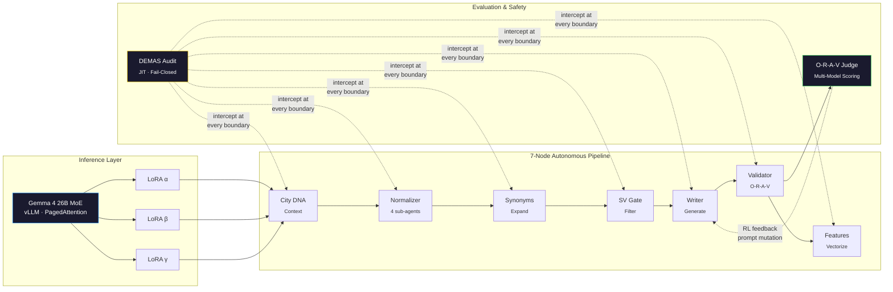

# Daniel Manzela

**Autonomous AI Systems Engineer**

*From architecture to execution — building reliable, steerable, and safe autonomous AI at enterprise scale*

 

---

### What I Build

I design and operate **end-to-end autonomous AI systems** — from 0→1 architecture through production optimization. My work sits at the intersection of multi-agent orchestration, fail-closed safety, and LLM evaluation, with a focus on systems that run with **zero human oversight** at enterprise scale.

**Current system in production:**
- **11 enterprise clients** across 4 countries, **~7.9M product data points** processed per cycle
- **7-node multi-agent DAG** with ~116M sub-agent executions per cycle
- **Gemma 4 MoE** on vLLM with tenant-isolated Multi-LoRA serving (<50ms adapter swap)
- **O-R-A-V** multi-model evaluation with fail-closed policy (68.9% pass rate by design)

---

### System Architecture

<b>Node Anatomy — Each node contains multiple sub-agents</b>

Every DAG node is a bounded ecosystem, not a single LLM call:

| Layer | Role | Example |
|---|---|---|
| **Deterministic Gate** | Schema validation, type coercion, regex | Pydantic, Python AST |
| **Probabilistic Agent** | Semantic extraction, classification | Gemini Vision, SLM |
| **Autonomy Layer** | O-R-A-V scoring, confidence thresholds | Multi-model consensus |
| **Memory** | Long-term state, prompt cache mutation | Redis LTM, Firestore |

The deterministic gate always fires first. The LLM is invoked **only if the gate passes**.

---

### Technical Focus

**AI & ML**

**Infrastructure & MLOps**

**Evaluation & Safety**

---

### Featured Work

| Repository | Description |
|---|---|
| [**pipeline-observatory**](https://github.com/Manzela/pipeline-observatory) | Interactive architecture visualization of the autonomous pipeline — MoE sparse routing, causal DAG tracing, and live execution telemetry. [Live Demo →](https://manzela.github.io/pipeline-observatory/) |
| [**gemma4-vllm-deployment**](https://github.com/Manzela/gemma4-vllm-deployment) | Forensic runbook documenting 20 failure modes across 30+ deployment versions of Gemma 4 MoE on Vertex AI with vLLM. The community reference for production MoE serving. |
| [**Antigravity-OS**](https://github.com/Manzela/Antigravity-OS) | AI governance kernel — cost enforcement, policy-as-code (OPA), deterministic state tracking, and self-healing CI for autonomous agent fleets. |

---

Israel (Relocating) · <a href="mailto:manzela@gmail.com">manzela@gmail.com</a>

