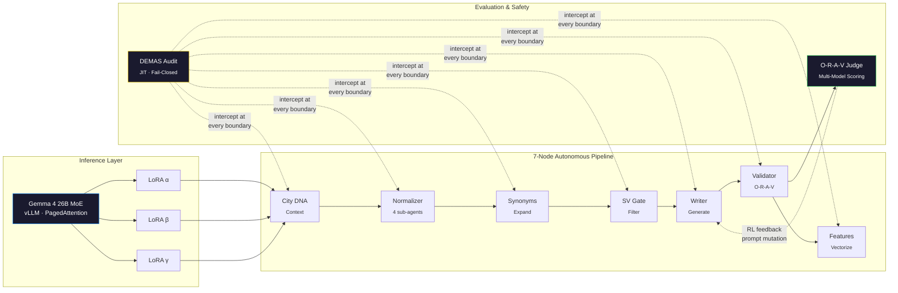

# Daniel Manzela

**Builder of Autonomous AI Systems**

*Ten years, six systems shipped. Today: a fail-closed AI pipeline serving 11 enterprise clients across 5 countries.*

 

---

### What I Build

I design and operate **end-to-end autonomous AI systems** — from zero-to-one architecture through production. My work sits at the intersection of multi-agent orchestration, fail-closed safety, and LLM evaluation. The systems I build run with **zero human oversight** at enterprise scale.

**Current system in production (TNG Shopper, 2024 → present):**
- **11 enterprise clients** across **5 countries** (ES · PT · IL · US · MX) — **~10.5M product pages under autonomous management** at **$0.0006 / page**
- **7-node multi-agent directed acyclic graph** with **~73.5M sub-agent operations per run** · 234 managed websites
- **Gemma 4 26B-A4B Mixture-of-Experts** on self-hosted vLLM with PagedAttention inference. Multi-Low-Rank-Adaptation research documented in the [forensic runbook](https://github.com/Manzela/gemma4-vllm-deployment).
- **Originality, Relevance, Accuracy, Value** — four-axis multi-model evaluation with fail-closed policy at **68.9% pass rate by design** · Deterministic Evaluation and Monitoring Audit System enforcing every boundary

**Ten years to get here.** Six projects. The pattern: how to unblock human-dependencies. See the [profile time-spine →](https://manzela.github.io/Manzela/#arc).

---

### System Architecture

<b>Node Anatomy — Each node contains multiple sub-agents</b>

Every directed-acyclic-graph node is a bounded ecosystem, not a single LLM call:

| Layer | Role | Example |
|---|---|---|
| **Deterministic Gate** | Schema validation, type coercion, regex | Pydantic, Python AST |
| **Probabilistic Agent** | Semantic extraction, classification | Gemini Vision, SLM |
| **Autonomy Layer** | Originality-Relevance-Accuracy-Value scoring, confidence thresholds | Multi-model consensus |
| **Memory** | Long-term state, prompt cache mutation | Redis LTM, Firestore |

The deterministic gate always fires first. The LLM is invoked **only if the gate passes**.

---

### Technical Focus

**AI & ML**

**Infrastructure & MLOps**

**Evaluation & Safety**

---

### Featured Work

#### The Arc — six case studies, in chronological order

| Year | Project | What it proved |
|---|---|---|
| 2016 | [**Asset**](https://manzela.github.io/Manzela/asset/) (Sept 2016 — 2019) | Three years of solo contractor work for new-stage startups: web setups, ERP→web ETL by hand, spreadsheet automation, business plans. *The data-transformation reps every later pipeline compounded on.* |
| 2019 | [**Data Mining**](https://manzela.github.io/Manzela/data-mining/) (Feb 2019 — Jul 2020) | Five-stage manually-orchestrated pipeline for an Israeli financial-services firm. ₪50M+ in new Assets Under Management. *A pipeline is a series of filters, not a series of steps.* |
| 2020 | [**Seller App**](https://manzela.github.io/Manzela/seller-app/) (Jan 2020 — Apr 2024) | Computer vision for retail digitization. 3 computer-vision generations · 60M+ canonical Stock-Keeping Units · $10K Monthly Recurring Revenue plateau. The architectural origin of retrieval-grounded computer vision. |
| 2020 | [**Tasko AI**](https://manzela.github.io/Manzela/tasko-ai/) (Oct 2020 — Dec 2023) | Production agentic system before the term existed. 21,102 labeled tasks · 153 clients · 1,561 intent patterns · 4-layer Classify / Retrieve / Execute / Verify. |
| 2024 | [**Elysium**](https://manzela.github.io/Manzela/elysium/) (2024 — 2025, paused-pending-Pipeline) | Physical-Context AI for Retail. 13 brands validated · 15,600+ store locations · 15 patent claims (3 independent + 12 dependent). |
| 2024 | [**Pipeline Observatory**](https://manzela.github.io/pipeline-observatory/) (2024 — present) | The synthesis. Seven-node directed acyclic graph, deterministic gates first, fail-closed by default. 10.5M product detail pages / cycle · 73.5M ops / run · $0.0006 / page · 68.9% pass rate across Originality, Relevance, Accuracy, Value. |

#### Open-source distillations (parallel track)

| Repository | Description |
|---|---|
| [**agent-dag-pipeline**](https://github.com/Manzela/agent-dag-pipeline) | Open-source distillation of the seven-node directed acyclic graph. Google Agent Development Kit + Vertex AI + four-axis Originality-Relevance-Accuracy-Value evaluation + Direct Preference Optimization data flywheel. |
| [**Antigravity-OS**](https://github.com/Manzela/Antigravity-OS) · `pip install ag-os` | AI governance kernel — cost enforcement, Open Policy Agent-style policy-as-code, deterministic state tracking, Model Context Protocol server, and self-healing continuous-integration for autonomous agent fleets. |
| [**gemma4-vllm-deployment**](https://github.com/Manzela/gemma4-vllm-deployment) | Forensic runbook documenting 20 failure modes across 30+ deployment versions of Gemma 4 Mixture-of-Experts on Vertex AI with vLLM. The community reference for production Mixture-of-Experts serving. |
| [**pipeline-observatory**](https://github.com/Manzela/pipeline-observatory) | Source of the live observability site at [manzela.github.io/pipeline-observatory](https://manzela.github.io/pipeline-observatory/). Architecture visualization — Mixture-of-Experts sparse routing, causal directed-acyclic-graph tracing, live execution telemetry. |

---

Israel (Relocating) · <a href="mailto:danielq1603@gmail.com">danielq1603@gmail.com</a>

