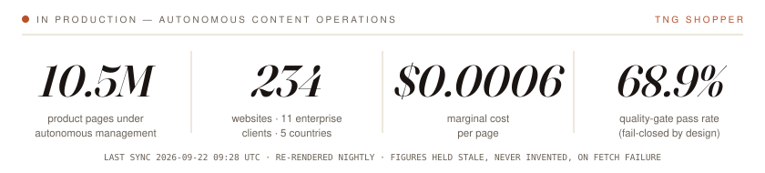

<div align="center">

# Daniel Manzela

**Founder & CEO, [TNG Shopper](https://tngshopper.com) · Senior AI Product Manager**

Autonomous multi-agent AI systems in production, at enterprise scale — no humans in the loop.

[](https://tngshopper.com)
[](https://manzela.github.io/Manzela/)
[](https://linkedin.com/in/manzela)
[](https://medium.com/@manzela)
[](mailto:danielq1603@gmail.com)

</div>

---

## 01 — The numbers

<div align="center">

<a href="https://manzela.github.io/Manzela/">
  
</a>

<!--START_SECTION:kpi_text-->**10.5M** product pages under autonomous management · **234** websites · 11 enterprise clients · 5 countries · **$0.0006** marginal cost per page · **68.9%** quality-gate pass rate (fail-closed by design)<!--END_SECTION:kpi_text-->

<sub>figures re-rendered nightly from <a href="https://manzela.github.io/pipeline-observatory/">production telemetry</a> · per-client evidence: <a href="https://manzela.github.io/pipeline-observatory/case-studies.html">Google Search Console case studies</a> · last audit: <!--START_SECTION:stamp-->2026-08-19<!--END_SECTION:stamp--></sub>

</div>

---

## 02 — Systems in production

| | System | Scale, verified | Live proof |
|---|---|---|---|
|  | **TNG Shopper** — autonomous content pipeline: 7-node gated DAG, self-hosted Gemma 4 26B MoE on vLLM | <!--START_SECTION:tng_metric-->10.5M pages · 234 sites · 11 enterprise clients · 5 countries<!--END_SECTION:tng_metric--> | [Pipeline Observatory](https://manzela.github.io/pipeline-observatory/) · [GSC evidence](https://manzela.github.io/pipeline-observatory/case-studies.html) |
|  | **Atelier** — autonomous design agent, Google for Startups AI Agents Challenge 2026 | Deterministic gates before any LLM judge · multi-judge consensus · DPO self-improvement flywheel | [atelier.autonomous-agent.dev](https://atelier.autonomous-agent.dev) · [Repo](https://github.com/Manzela/Atelier) |
|  | **agent-dag-pipeline** — the open-source fail-closed agent DAG behind the pipeline | <!--START_SECTION:agdag_metric-->~33,000 production LLM calls across 4 model generations<!--END_SECTION:agdag_metric--> | [Live telemetry](https://manzela.github.io/pipeline-observatory/) · [Video](https://youtu.be/czZsPbylC1M) |
|  | **ag-os** — governance kernel for AI agents (`pip install ag-os`) | <a href="https://pypi.org/project/ag-os/"></a> <a href="https://pypi.org/project/ag-os/"></a> | [PyPI](https://pypi.org/project/ag-os/) · [Repo](https://github.com/Manzela/Antigravity-OS) |

<sub>Status dots are re-probed nightly. A system that stops answering shows a hollow "unverified" dot; a persistently retired endpoint is demoted to "archived" — a live dot is never shown on a dead link.</sub>

---

## 03 — The open ledger

Selected engineering. Every claim maps to committed code — clone and verify, or read the auditor's notes in the appendix below, where each load-bearing figure is re-derived weekly in CI.

| Repository | One verified outcome | Signal |
|---|---|---|
| [**Atelier**](https://github.com/Manzela/Atelier) | Deterministic gates always precede probabilistic agents; hermetic, offline `make verify`; per-axis provenance on 5 rubric judges | Google AI Agents Challenge 2026 |
| [**agent-dag-pipeline**](https://github.com/Manzela/agent-dag-pipeline) | Fail-closed 7-node DAG: O·R·A·V multi-model evaluation, immutable failure records, DPO + LoRA self-improvement flywheel |  |
| [**Antigravity-OS**](https://github.com/Manzela/Antigravity-OS) | Zero-LLM governance kernel: policy-as-code constitution, solvency gate, flight recorder, full audit trail |  |
| [**gemma4-vllm-deployment**](https://github.com/Manzela/gemma4-vllm-deployment) | Every failure mode on the road to Gemma 4 MoE on vLLM / 1×A100-80GB, documented with its fix — plus the single working config | [Forensic runbook](https://github.com/Manzela/gemma4-vllm-deployment/blob/main/docs/FORENSIC_RUNBOOK.md) |
| [**WP-Multisite**](https://github.com/Manzela/WP-Multisite) | The production publishing surface behind the pipeline, sanitized verbatim — 1,056-line JSON-LD generator, AI-search-aware `llms.txt` / `robots.txt` | Production blueprint |

---

## 04 — Fail-closed, by construction

> The secret isn't making the AI smarter — it's building a strict system of rules that automatically catches and drops the AI's mistakes.

| Layer | Mechanism | Committed in |
|---|---|---|
| Spend | Per-user lifetime token cap enforced server-side **before** any model call | [Atelier](https://github.com/Manzela/Atelier) |
| Spend | Daily hard cap at the LLM proxy · alerts at 50 / 75 / 90 / 100% | [AutonomousAgent](https://github.com/Manzela/AutonomousAgent) |
| State | Immutable `FailureRecord` on every exit · store-context integrity asserted at ENTRY and PRE_EXPORT | [agent-dag-pipeline](https://github.com/Manzela/agent-dag-pipeline) |
| Policy | Policy-as-code constitution · solvency gate · retry limit with human escalation · zero-LLM core | [Antigravity-OS](https://github.com/Manzela/Antigravity-OS) |
| Input | Prompt-injection screening wraps every model call | [Atelier](https://github.com/Manzela/Atelier) · [agent-dag-pipeline](https://github.com/Manzela/agent-dag-pipeline) |
| Training | RL kill-switches on cost overrun and eval regression · promotion only on measured eval gain | [AutonomousAgent](https://github.com/Manzela/AutonomousAgent) |

**Operating principles**

1. **Deterministic gates in front of probabilistic agents — never the reverse.** Invalid input is rejected before a single token is spent.
2. **Fail closed.** Every pipeline exit is a recorded, causally-traced failure; budget caps are enforced server-side before any model call.
3. **Self-improvement is governed.** DPO/RLAIF flywheels promote adapters only past gated evals, with kill-switches on cost overrun and regression.

---

## 05 — This quarter

<table><tr><td valign="top" width="50%">

**Recent releases**
<!--START_SECTION:releases-->
- [AutonomousAgent — phase1.0.1-accepted](https://github.com/Manzela/AutonomousAgent/releases/tag/phase1.0.1-accepted) · 2026-05
- [Antigravity-OS — v1.2.0: Dreaming Module — Self-Improvement for Any LLM](https://github.com/Manzela/Antigravity-OS/releases/tag/v1.2.0) · 2026-05
<!--END_SECTION:releases-->

</td><td valign="top" width="50%">

**Recent writing**
<!--START_SECTION:writing-->
- [The Physical-Context Flywheel](https://medium.com/kairi-ai/the-physical-context-flywheel-4964b6e45115) · Nov 2025
- [Epiphany](https://medium.com/@manzela/epiphany-7d7c9f4dd857) · Nov 2025
- [Generative Engine Optimization (GEO): Strategic Implementation and Advanced Tactics](https://medium.com/@manzela/generative-engine-optimization-geo-strategic-implementation-and-advanced-tactics-f112e4dbbd3b) · Jun 2025
- [From SEO to GEO: Navigating the New Landscape of Search](https://medium.com/@manzela/from-seo-to-geo-navigating-the-new-landscape-of-search-f30f15f8ccb4) · Jun 2025
<!--END_SECTION:writing-->

</td></tr></table>

---

## 06 — Credentials & recognition

<a href="https://partner.skills.google/public_profiles/69fa3af8-3032-4a04-a818-f7277009c3a9"></a>
<a href="assets/retailtech-2025-report.pdf"></a>

<!--START_SECTION:certs-->
Google Cloud **Generative AI Leader** (active) · Google Cloud **Professional ML Engineer** (Jun 2026) · Product Experts **Certified Product Manager** (active) · CrewAI **Multi-Agent Systems** (active) · **32** Google Cloud credentials · Guest lecturer, Bar-Ilan University (May 2025)
<!--END_SECTION:certs-->

Named inventor on **15 patent claims** in physical-context AI — an 11-agent system fusing search-intent and geospatial data to forecast street-level demand across 15,600+ store locations. [The Elysium case study](https://manzela.github.io/Manzela/elysium/)

---

## 07 — Contact

Building [TNG Shopper](https://tngshopper.com) full-time. Talking to **enterprise retail teams, partners, and investors** about autonomous content operations.

**[danielq1603@gmail.com](mailto:danielq1603@gmail.com)** · [LinkedIn](https://linkedin.com/in/manzela) — I read every message.

<sub>**Colophon** — this page maintains itself: a nightly GitHub Action re-renders every figure and health probe, and a weekly audit job re-derives every load-bearing claim from a fresh clone of its source repo. Anything it cannot verify is stamped stale — never invented. [The nightly workflow](.github/workflows/profile-refresh.yml) · [The weekly audit](.github/workflows/verify-claims.yml) · [The build script](profile/build_profile.py)</sub>

---

<details>
<summary><b>Appendix — stack, auditor's notes &amp; the longer story</b></summary>

<br>

**Where I'm fluent**

```text
agents      google-adk · vertex-agent-engine · mcp · a2a · litellm · crewai
training    dpo / preference-tuning · lora / s-lora / qlora · rlaif flywheels · ppo / grpo
serving     vllm (moe, multi-lora, a100) · cloud-run · gke · fastapi · gcsfuse
evals       llm-as-judge (o·r·a·v) · multi-judge consensus · golden trajectories · axe / lighthouse
guardrails  model-armor · policy-as-code (ag-os) · budget caps · tiered sandboxes · opa · vault
telemetry   opentelemetry · cloud-trace · langfuse · arize phoenix · bigquery
data        apache beam / dataflow · pub/sub · postgres · redis · vector dbs · uber h3
platforms   gcp (vertex ai · bigquery · gke) · kubernetes · terraform · wordpress multisite · shopify
languages   python · go · node.js · typescript · react
```

**Auditor's notes** — every load-bearing number on this page is re-derived from a fresh clone, weekly, in CI. A figure that can't be reproduced is stamped stale, not repeated.

<!--START_SECTION:claims-->
| Claim | Value | Derived by | Verified |
|---|---:|---|---|
| Test functions ([Atelier](https://github.com/Manzela/Atelier)) | 1,315 in 120 files | `grep -rcE '^\s*(async )?def test_' --include='*.py'` on fresh clone | ⚠ stale since 2026-08-10 |
| Test functions ([AutonomousAgent](https://github.com/Manzela/AutonomousAgent)) | 2,011 in 198 files | `grep -rcE '^\s*(async )?def test_' --include='*.py'` on fresh clone | 2026-08-17 |
| Test functions ([Antigravity-OS](https://github.com/Manzela/Antigravity-OS)) | 133 in 9 files | `grep -rcE '^\s*(async )?def test_' --include='*.py'` on fresh clone | 2026-08-17 |
| Test functions ([agent-dag-pipeline](https://github.com/Manzela/agent-dag-pipeline)) | 61 in 4 files | `grep -rcE '^\s*(async )?def test_' --include='*.py'` on fresh clone | 2026-08-17 |
| O·R·A·V gate thresholds ([agent-dag-pipeline](https://github.com/Manzela/agent-dag-pipeline)) | 0.6 / 0.7 / 0.8 / 0.6 | constants in `agent_dag/config.py`, fresh clone | 2026-08-17 |
| Constitution rules ([Antigravity-OS](https://github.com/Manzela/Antigravity-OS)) | 9 | count of `templates/rules/*.md` on fresh clone | 2026-08-17 |
| Documented failure modes, forensic runbook ([gemma4-vllm-deployment](https://github.com/Manzela/gemma4-vllm-deployment)) | 19 | numbered `###` sections in `docs/FORENSIC_RUNBOOK.md`, fresh clone | 2026-08-17 |
<!--END_SECTION:claims-->

**Also in the lab** — [AutonomousAgent](https://github.com/Manzela/AutonomousAgent): production-hardened self-improving agent running 24/7 on GCP — 5-tier sandboxing, OpenTelemetry tracing, fail-closed failure matrix, MoE-routed RL self-training

**Before TNG Shopper** — CTO & AI Product Engineer at Tasko AI: a WhatsApp-native assistant for 153 paying clients resolving 1,561 distinct user intents, pre-trained on 21M+ messages · a camera-first retail onboarding tool (0 → $10K MRR, 3 computer-vision pipelines, 60M+ SKU catalog) · a 6-stage lead-qualification pipeline that drove $17M+ in new assets under management

**The longer story (2013 → now)** — [Elysium](https://manzela.github.io/Manzela/elysium/) · [Tasko AI](https://manzela.github.io/Manzela/tasko-ai/) · [Seller App](https://manzela.github.io/Manzela/seller-app/) · [Data Mining](https://manzela.github.io/Manzela/data-mining/) · [Junior Years](https://manzela.github.io/Manzela/junior-years/) · [Essays](https://medium.com/@manzela)

<sub>Numerals on this page are set in <a href="https://fonts.google.com/specimen/Fraunces">Fraunces</a> (OFL), pre-outlined so they render identically everywhere. English · Hebrew · Russian.</sub>

</details>

<div align="center"><sub>Tel Aviv &amp; the wire</sub></div>
