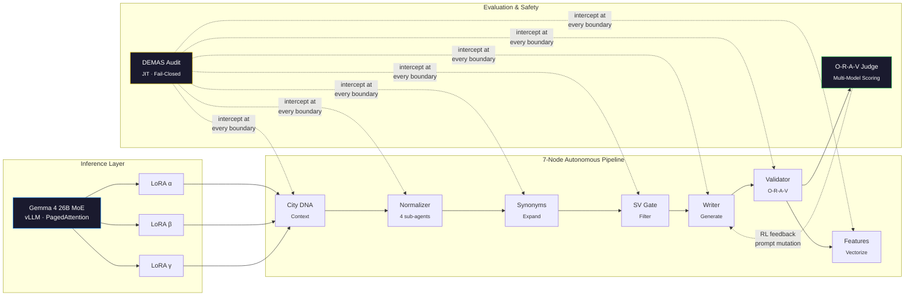

# Daniel Manzela

**Founding AI Product Builder**

*Co-founder, CEO and CPO · TNG Shopper*

 

---

### What I Build

End-to-end autonomous AI systems — from zero-to-one architecture through production. My focus: multi-agent orchestration, fail-closed safety, and multi-model LLM evaluation.

**In production at TNG Shopper (2024 → present):**
- 7-node multi-agent DAG · ~10.5M product pages under autonomous management · ~73.5M agent operations per full run · $0.0006 / page · 11 enterprise clients across 5 countries (ES · PT · IL · US · MX)
- Gemma 4 26B-A4B Mixture-of-Experts on self-hosted vLLM with PagedAttention · Multi-LoRA adaptation ([forensic runbook](https://github.com/Manzela/gemma4-vllm-deployment))
- Four-axis multi-model evaluation (Originality · Relevance · Accuracy · Value) with fail-closed policy at 68.9% pass rate by design · Deterministic gates enforce every node boundary

---

### System Architecture

```mermaid
graph LR
  subgraph Inference["Inference Layer"]
    MoE["Gemma 4 26B MoE<br/>vLLM · PagedAttention"]
    L1["LoRA α"]
    L2["LoRA β"]
    L3["LoRA γ"]
    MoE --> L1 & L2 & L3
  end

  subgraph DAG["7-Node Autonomous Pipeline"]
    N1["City DNA<br/><sub>Context</sub>"] --> N2["Normalizer<br/><sub>4 sub-agents</sub>"]
    N2 --> N3["Synonyms<br/><sub>Expand</sub>"]
    N3 --> N4["SV Gate<br/><sub>Filter</sub>"]
    N4 --> N5["Writer<br/><sub>Generate</sub>"]
    N5 --> N6["Validator<br/><sub>O-R-A-V</sub>"]
    N6 --> N7["Features<br/><sub>Vectorize</sub>"]
  end

  subgraph Eval["Evaluation & Safety"]
    ORAV["O-R-A-V Judge<br/><sub>Multi-Model Scoring</sub>"]
    DEMAS["DEMAS Audit<br/><sub>JIT · Fail-Closed</sub>"]
  end

  L1 & L2 & L3 --> N1
  N6 --> ORAV
  DEMAS -.->|"intercept at<br/>every boundary"| N1 & N2 & N3 & N4 & N5 & N6 & N7
  ORAV -.->|"RL feedback<br/>prompt mutation"| N5

  style MoE fill:#1a1a2e,stroke:#0A84FF,color:#fff
  style ORAV fill:#1a1a2e,stroke:#30D158,color:#fff
  style DEMAS fill:#1a1a2e,stroke:#FFD60A,color:#fff
```

<b>Node anatomy — each node contains multiple sub-agents</b>

Every DAG node is a bounded ecosystem, not a single LLM call:

| Layer | Role | Example |
|---|---|---|
| **Deterministic Gate** | Schema validation, type coercion, regex | Pydantic, Python AST |
| **Probabilistic Agent** | Semantic extraction, classification | Gemini Vision, SLM |
| **Autonomy Layer** | O-R-A-V scoring, confidence thresholds | Multi-model consensus |
| **Memory** | Long-term state, prompt cache mutation | Redis LTM, Firestore |

The deterministic gate always fires first. The LLM is invoked **only if the gate passes**.

---

### Open Source

| Repository | |
|---|---|
| [**agent-dag-pipeline**](https://github.com/Manzela/agent-dag-pipeline) | 7-node autonomous agent DAG · Google ADK + Vertex AI · O-R-A-V evaluation · DPO data flywheel |
| [**Antigravity-OS**](https://github.com/Manzela/Antigravity-OS) &nbsp;`pip install ag-os` | AI dev governance kernel · 9-rule constitutional policy-as-code · Cost Guard · Self-Healing CI · Dreaming Module |
| [**gemma4-vllm-deployment**](https://github.com/Manzela/gemma4-vllm-deployment) | Forensic runbook · 20 failure modes · Gemma 4 MoE on Vertex AI + vLLM |
| [**pipeline-observatory**](https://github.com/Manzela/pipeline-observatory) | Live architecture visualization · MoE sparse routing · causal DAG tracing · execution telemetry |
| [**Atelier**](https://github.com/Manzela/Atelier) | Autonomous design agent · Google for Startups AI Agents Challenge 2026 |

---

<a href="mailto:manzela@tngshopper.com">manzela@tngshopper.com</a>

