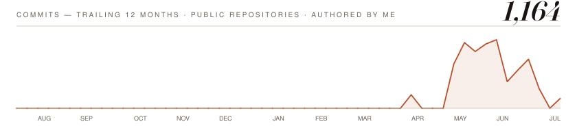
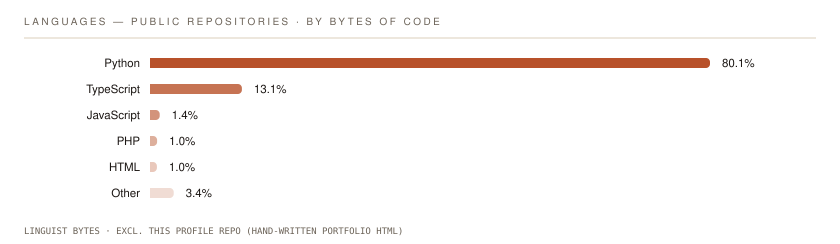
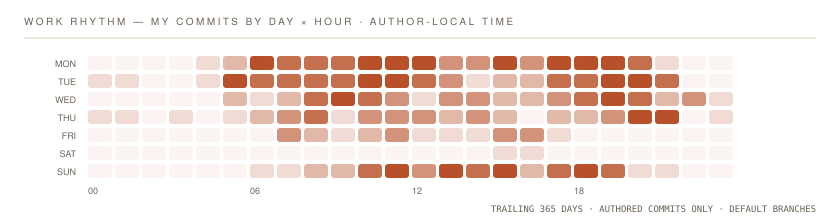

# Hi, I'm Daniel

I build autonomous multi-agent AI systems — the kind that run with **no human in the loop** — so most of my work is really about making that safe: deterministic gates in front of probabilistic agents, fail-closed pipelines, self-improvement that has to pass an eval to ship. Mostly Python, with TypeScript where the product needs it. Tel Aviv.

**Now** — [Atelier](https://github.com/Manzela/Atelier), an autonomous zero-shot design agent for the Google for Startups AI Agents Challenge 2026, and the open-source agent stack underneath it.

[manzela.github.io](https://manzela.github.io/Manzela/) · [essays](https://medium.com/@manzela) · [LinkedIn](https://linkedin.com/in/manzela) · [danielq1603@gmail.com](mailto:danielq1603@gmail.com)

### Selected repositories

- [**Atelier**](https://github.com/Manzela/Atelier) — autonomous zero-shot design agent (Google for Startups AI Agents Challenge 2026): mixture-of-design-experts, five rubric judges with per-axis provenance, a per-project judge fine-tuned on accept/reject. Hermetic offline `make verify`.
- [**agent-dag-pipeline**](https://github.com/Manzela/agent-dag-pipeline) — production-grade 7-node agent DAG: fail-closed with immutable `FailureRecord`s, O·R·A·V multi-model evaluation (thresholds 0.6 / 0.7 / 0.8 / 0.6 in code), DPO + LoRA self-improvement with S-LoRA hot-reload. Hardened across four model generations in production. Apache-2.0.
- [**Antigravity-OS**](https://github.com/Manzela/Antigravity-OS) — zero-LLM governance kernel for AI agents: a 9-rule policy-as-code constitution, solvency gate, flight recorder. `pip install ag-os`.
- [**AutonomousAgent**](https://github.com/Manzela/AutonomousAgent) — self-improving agent running 24/7 on GCP: 5-tier sandboxing, OpenTelemetry tracing, fail-closed failure matrix, MoE-routed RL self-training (PPO with KL trust-region, GRPO).
- [**gemma4-vllm-deployment**](https://github.com/Manzela/gemma4-vllm-deployment) — forensic runbook of deploying Gemma 4 27B MoE on Vertex AI with vLLM: 19 numbered failure modes, each documented with its fix, and the single working config for 1×A100-80GB.
- [**WP-Multisite**](https://github.com/Manzela/WP-Multisite) — AI-search-aware WordPress multisite blueprint, sanitized from production: a 1,000+ line JSON-LD schema generator (exact count CI-verified below), `llms.txt`, explicit ALLOW contracts for AI crawlers.

All six share one invariant:

```text
deterministic gates  →  probabilistic agents  →  fail-closed exits
```

Invalid work is rejected before a token is spent, and every exit is a recorded `FailureRecord`, never a silent drop. Self-improvement is promoted only past gated evals.

<sub>Every counted claim above (test suites, gate thresholds, rule counts) is re-derived weekly in CI from a fresh clone — see the Provenance appendix below.</sub>

### In production

The production deployment of this stack is [TNG Shopper](https://tngshopper.com)'s content pipeline: a 7-node gated DAG on Vertex AI serving a self-hosted Gemma 4 26B MoE through vLLM with Multi-LoRA, no human in the loop. Quality is enforced by fail-closed O·R·A·V gates — generations that don't clear the thresholds are dropped, by design — with OpenTelemetry and Langfuse tracing end to end. ~10.5M pages under autonomous management. [agent-dag-pipeline](https://github.com/Manzela/agent-dag-pipeline) is the open-source core; live telemetry at [pipeline-observatory](https://manzela.github.io/pipeline-observatory/).

### Activity







<sub>Rendered nightly from my own GitHub data by [build_profile.py](profile/build_profile.py) — no third-party stat cards. On any fetch failure yesterday's chart is kept and stamped stale; nothing is invented. Last render: <!--START_SECTION:stamp-->2026-07-19<!--END_SECTION:stamp--></sub>

---

Also: named inventor on 15 patent claims in physical-context AI · occasional guest lecturer at Bar-Ilan University · essays at [medium.com/@manzela](https://medium.com/@manzela).

<details>
<summary>Provenance — how the numbers on this page are checked</summary>

<!--START_SECTION:claims-->
| Claim | Value | Derived by | Verified |
|---|---:|---|---|
| Test functions ([Atelier](https://github.com/Manzela/Atelier)) | 1,315 in 120 files | `grep -rcE '^\s*(async )?def test_' --include='*.py'` on fresh clone | 2026-07-20 |
| Test functions ([AutonomousAgent](https://github.com/Manzela/AutonomousAgent)) | 2,011 in 198 files | `grep -rcE '^\s*(async )?def test_' --include='*.py'` on fresh clone | 2026-07-20 |
| O·R·A·V gate thresholds ([agent-dag-pipeline](https://github.com/Manzela/agent-dag-pipeline)) | 0.6 / 0.7 / 0.8 / 0.6 | constants in `agent_dag/config.py`, fresh clone | 2026-07-20 |
| Constitution rules ([Antigravity-OS](https://github.com/Manzela/Antigravity-OS)) | 9 | count of `templates/rules/*.md` on fresh clone | 2026-07-20 |
| Documented failure modes, forensic runbook ([gemma4-vllm-deployment](https://github.com/Manzela/gemma4-vllm-deployment)) | 19 | numbered `###` sections in `docs/FORENSIC_RUNBOOK.md`, fresh clone | 2026-07-20 |
| JSON-LD schema generator, lines ([WP-Multisite](https://github.com/Manzela/WP-Multisite)) | 1,057 | `wc -l` on `SchemaServiceProvider.php`, fresh clone | 2026-07-20 |
<!--END_SECTION:claims-->

</details>

<sub>This page maintains itself: a nightly Action re-renders the charts from the GitHub API, and a weekly job re-derives every load-bearing claim from a fresh clone of its source repo. [build_profile.py](profile/build_profile.py) · [profile-refresh.yml](.github/workflows/profile-refresh.yml) · [verify-claims.yml](.github/workflows/verify-claims.yml)</sub>
